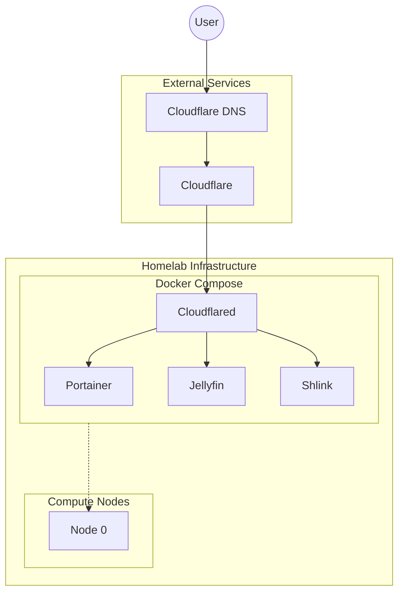
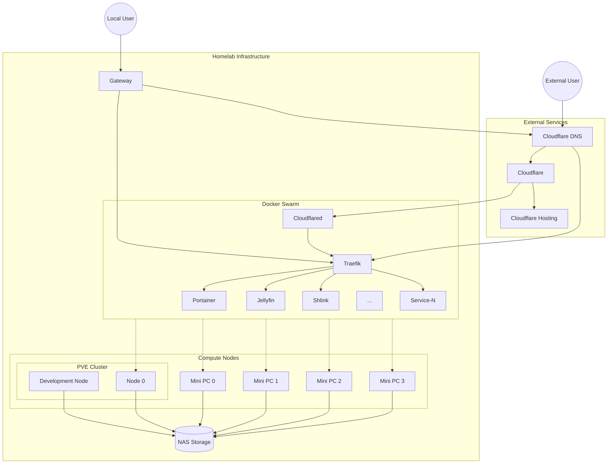

This is kind of a review on the past 12 months since moving my cloud hosted services to all self-hosted, and the sequence of upgrades and changes to my homelab throughout the process.

After a few months of increasingly larger GCP bills, and a final month of accidentally leaving a Cloud Workstation running for a little too long, I decided to give the old self-hosted world a try again after having most of my projects running somewhere in the cloud for the past 5 years, and seeing if I could pull off a $0 GCP bill the end of the next month.

The first thing was to pull out a gaming PC I bought a few years before, but had switched off some time ago due to using the XBOX as the gaming rig instead. The PC was a mid-specced computer with an RTX 3060, 6-core 3.9GHz processor, and some 16GB of memory, enough to at least get started.

At the time I booted everything up, I was still running all of my local devices 100% over Wi-Fi, and running on a 5G Home Mobile connection. I already had Ubuntu formatted onto one of the drives for whatever reason, and docker was naturally already running. The 5G connection presented it's first point of contention with the lack of any ability for statically setting an IP address at least having some stability in a dynamically assigned address.

One option considered was to use a Dynamic DNS service, but given the TTL on the domain would need to be set so low to not cause significant issue I looked for other options. I came across Cloudflare Zero Trust tunnels, which seemed to provide what I need: some stability in public facing domain names.

Once I had the tunnels figured out and running, I had my first basic setup running:

