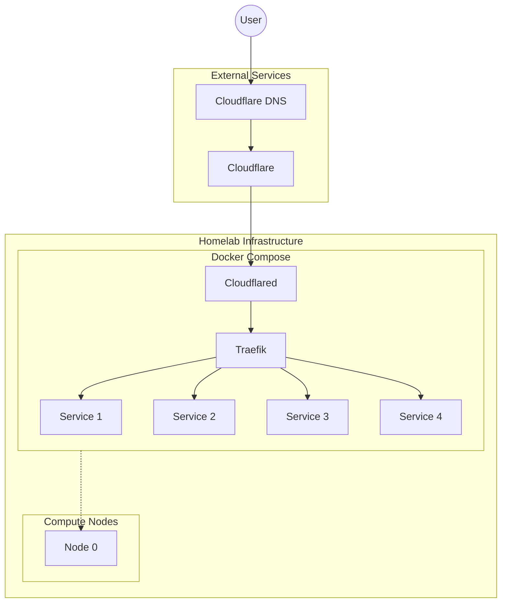
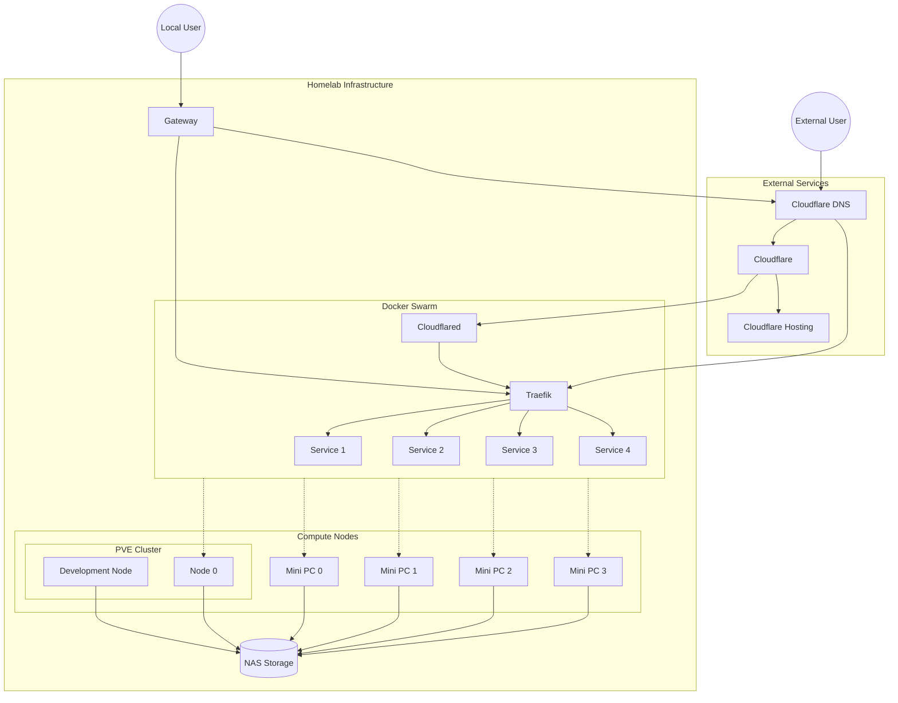

12 months ago, I decided to make the move to self-hosting and removing any dependancies from GCP and other cloud providers. This was thanks to my own <...> after accidentally leaving a GCP Cloud Workstation running for a few days. This and a few other services I had been toying around with ran me up around $434.74 in the 4 months from January to April last year. When I received my bill come May I decided enough was enough and I would commit to having $0 bills by the next month.

