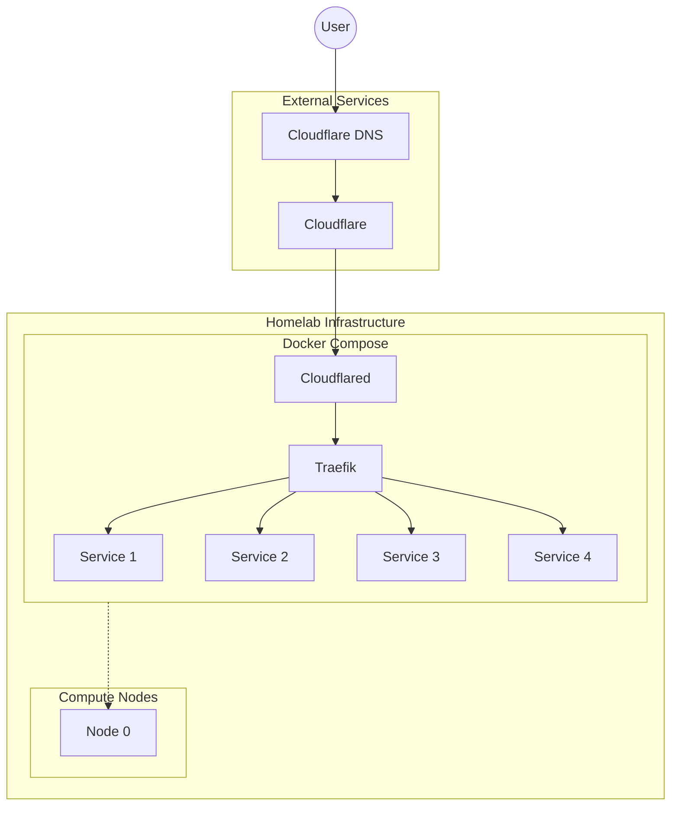
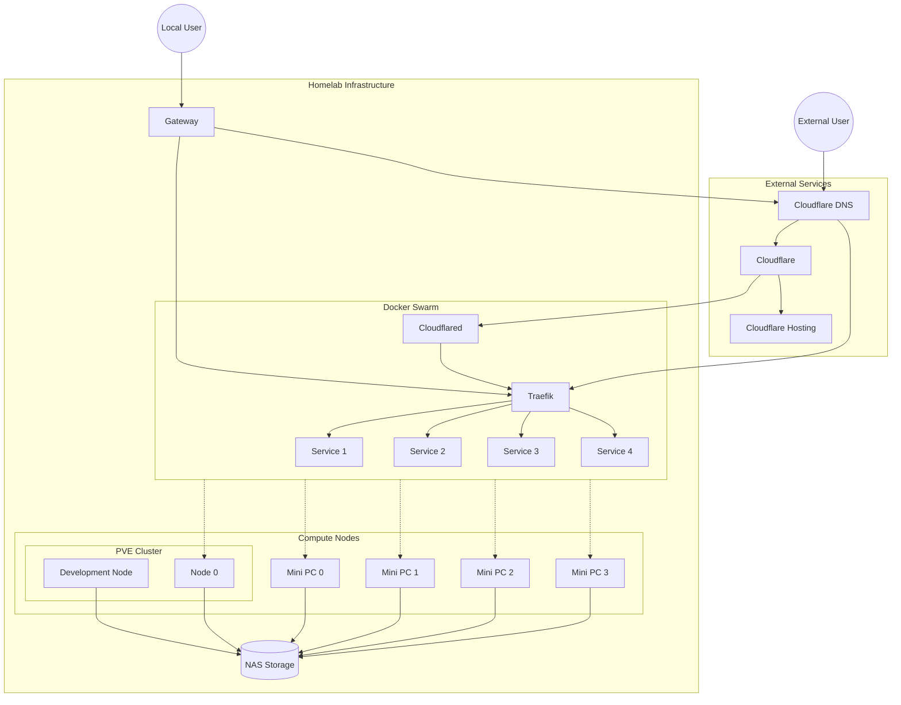

```mermaid
flowchart TD
    user((User))
    
    subgraph external-services [External Services]
        cloudflare[Cloudflare]
        cloudflare-dns[Cloudflare DNS]
    end
    
    subgraph homelab [Homelab Infrastructure]
        subgraph compute-nodes [Compute Nodes]
            node0[Node 0]
        end

        subgraph compose [Docker Compose]
            service-1[Service 1]
            service-2[Service 2]
            service-3[Service 3]
            service-4[Service 4]

            cloudflared[Cloudflared]
            traefik[Traefik]
        end
    end
    
    user --> cloudflare-dns
    cloudflare-dns --> cloudflare
    cloudflare --> cloudflared
    cloudflared --> traefik
    traefik --> service-1 & service-2 & service-3 & service-4

    compose -..-> node0
```

```mermaid
flowchart TD
    user((External User))
    local-user((Local User))

    subgraph external-services [External Services]
        cloudflare[Cloudflare]
        cloudflare-hosting[Cloudflare Hosting]
        cloudflare-dns[Cloudflare DNS]
    end

    subgraph homelab [Homelab Infrastructure]
        subgraph compute-nodes [Compute Nodes]
            subgraph pve [PVE Cluster]
                dev[Development Node]
                node0[Node 0]
            end

            tc0[Mini PC 0]
            tc1[Mini PC 1]
            tc2[Mini PC 2]
            tc3[Mini PC 3]
        end

        nas[(NAS Storage)]

        gateway[Gateway]

        subgraph swarm [Docker Swarm]
            service-1[Service 1]
            service-2[Service 2]
            service-3[Service 3]
            service-4[Service 4]

            cloudflared[Cloudflared]
            traefik[Traefik]
        end
    end

    local-user --> gateway
    gateway --> cloudflare-dns
    gateway --> traefik

    user --> cloudflare-dns
    cloudflare-dns --> cloudflare
    cloudflare --> cloudflared
    cloudflared --> traefik
    cloudflare --> cloudflare-hosting

    cloudflare-dns --> traefik

    traefik --> service-1 & service-2 & service-3 & service-4
    swarm -..-> node0 & tc0 & tc1 & tc2 & tc3
    dev & node0 & tc0 & tc1 & tc2 & tc3 --> nas
```