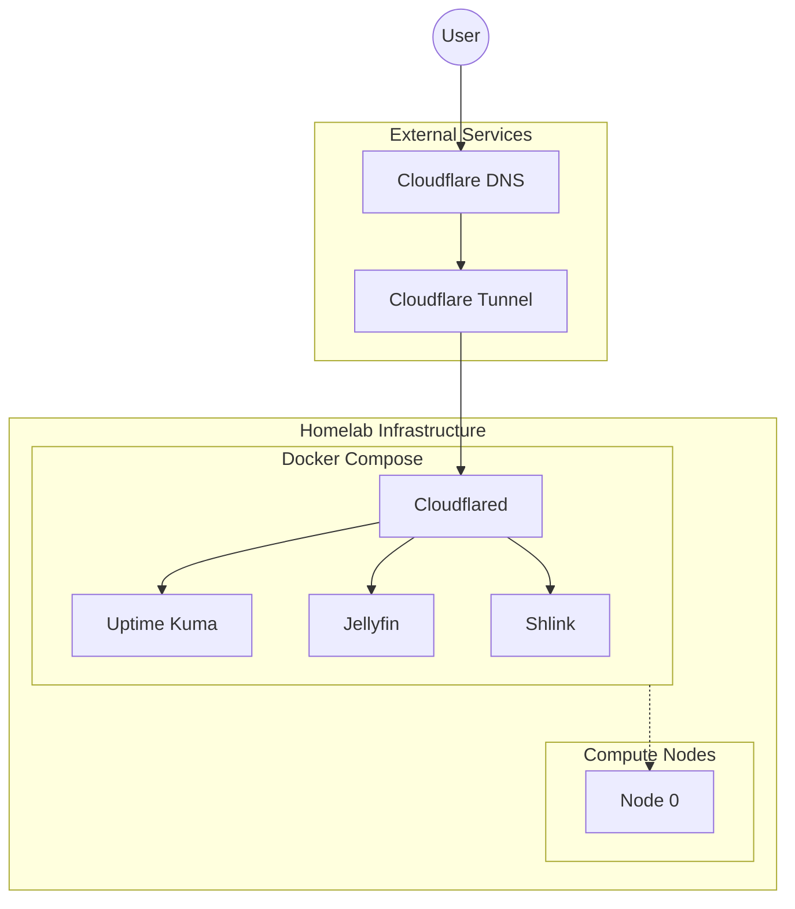
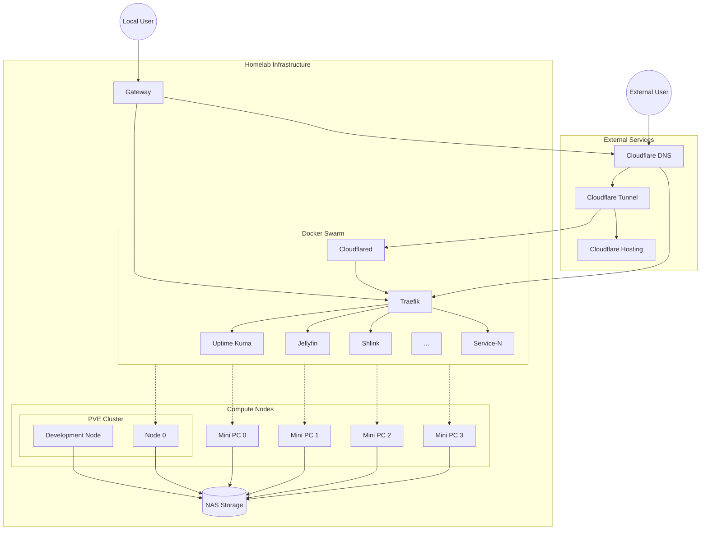

This is kind of a review on the past 12 months since moving my cloud hosted services to all self-hosted, and the sequence of upgrades and changes to my homelab throughout the process.

After a few months of increasingly larger GCP bills, and a final month of accidentally leaving a Cloud Workstation running for a little too long, I decided to give the old self-hosted world a try again after having most of my projects running somewhere in the cloud for the past 5 years, and seeing if I could pull off a $0 GCP bill by the end of the next month.

## Getting Started

The first thing was to pull out a gaming PC I bought a few years ago, but had switched off some time ago due to using the XBOX as the gaming rig instead. The PC was a mid-specced computer with an RTX 3060, 6-core 3.9GHz processor, and some 16GB of memory, enough to at least get started.

At the time I booted everything up, I was still running all of my local devices 100% over Wi-Fi, and running on a 5G Home Mobile connection. I already had Ubuntu formatted onto one of the drives for whatever reason, and docker was naturally already running. The 5G connection presented it's first point of contention with the lack of any ability for statically setting an IP address at least having some stability in a dynamically assigned address.

## Network Challenges and Solutions

One option considered was to use a Dynamic DNS service, but given the TTL on the domain would need to be set so low to not cause significant issue I looked for other options. I came across Cloudflare Zero Trust tunnels, which seemed to provide what I need: some stability in public facing domain names.

Once I had the tunnels figured out and running, I had my first basic setup running:

This setup was my first step in being able to start turning off my Cloud Run services and other projects I had running on cloud. One of the services I had setup was Uptime Kuma, to ensure that all of my services were running fine. Unlike a local Docker instance, or running services on GCP, I didn't really have insight into what services were up, if any had crashed, or any level of insight without shelling into the machine and manually checking.

What Uptime Kuma highlighted was that occasionally and every few hours the requests to any of the services were timing out. Since it applied to all services across the board, I figured it must have to be something on the machine or the network. The logs on the machine and all services looked fine and didn't indicate they went down or anything similar, so I put this down to network issue.

Running services over Wi-Fi on a 5G connection probably wasn't the most stable setup I could have picked and so the first point of order was to wire the machine into my 5G modem/router directly. This seemed to solve some of the dropped connections but the issue still persisted. This mostly went on for a few months until I also upgraded the internet to a gigabit fibre connection when I realised my building supported it.

With the machine wired in and eventually move to a wired connection, this did resolve all of the issues I had seen before.

## Early Development and GitOps

With everything running stable it was time to actually start utilising what I had and start running some stuff. Over the course of a few months I had deployed some hobby projects I'd been working on, as well as some local services like Portainer, and had set up GitHub actions to act as my deployment process. This was done by creating a repo with all of the compose configuration, and creating a GitHub action to `docker compose up -d` on the single compose file I had defined.

This is where the second contention came up. I often found myself test deploying services and leaving the test compose defined on the machine that I'd just shell into. This often led to a drift in what was defined in GitHub and what was actually deployed. Working across many machines was basically made impossible.

For this reason I decided I should separate my development and deployment environments. Hearing word on proxmox and people using virtualisation in their labs, this sounded like a good starting approach and to just run 2 separate machines, one with docker running and the other with my JetBrains gateway host running.

## The Proxmox Disaster

Step 1 to install proxmox, format drives and create a fresh installation. Done. Step 2, boot up and create VMs. Done. Step 3, set up the VMs and get all of the previous services back up and running. Oh, I just formatted the drives. Crap.

This was probably the hardest lesson to learn. I just lost all of the services I had running, and considering most were still half-deployed locally without any sort of backed up configuration I lost most of what I had set up. This doesn't include everything else I had used the computer for previously for personal use, it was all gone.

What a dumb mistake.

## Rebuilding with Better Practices

From this point on it was clear I needed better rules for myself on keeping backups, and not allowing myself to lose everything in one go. Luckily at least most of the services I cared about were set up months ago and had made their way to the repo, and for personal stuff I was able to put together various backups, uploads etc I had collected over the years so not too much was lost.

I also put a note that anything on the machine could be lost at any time, so if it was important then don't leave just leave it on the machine. I had also later purchased a NAS to further remove any reliance on the machine.

Now with GitHub acting as the only source of method for deployments, anything else deployed had 0 expectation to be up and usable, the NAS serving as storage server for any services, and the network configuration, I was at a point again where things were stable and I was freely able to make changes and add new services without issue.

## Infrastructure as Code

I had at some point also been frustrated with the amount of manual changes needed for DNS settings, Zero Trust configuration changes, and other manual processes required every time I span up new services, that I ended up added Terraform to the pipeline. This was one of the most satisfying changes with having everything simply defined in a single config.yaml and terraform handling the complexity, and updating references and related resources for me. Seeing Terraform tell me it's handling 150 resources is nice to know I'm not manually controlling that much.

## Scaling to Multiple Nodes

The last upgrade I had made since then is to buy 4x mini PCs with limited resources, running 4-core 2.2GHz processors and 16GB memory, just to reduce the load on the single machine I had running and allow for proxmox and the VMs to run updates etc. This was probably unnecessary to add but is a nice to have, and makes reliability just a little less of an issue.

The only issues with adding more nodes to the cluster is that I would have to find a new solution for defining and deploying services. Docker compose had been working great, but this only works for a single node. My two main options I was considering was using a lightweight kubernetes service like k3s, or using Docker swarm.

Kube is definitely the preferred tool for managing multiple node clusters, and managing the network etc between them for the services, but would require a large migration to change all my configs around and getting the services up and running. Docker swarm on the other hand would have a much simpler migration in that service configs are defined much the same as compose, but had more limitations in it's ability, particularly as I had found during a test with some friends running across 4 physical locations.

For my setup though, I tested using swarm initially given the lower barrier to entry, and it seemed to work fine. A couple tweaks here and there to service configs and everything was up and running fine on the swarm, other than a few difficulties with GPUs, but I've already explored that and resolved issues, mostly, for services that need it.

With that all said and done, the last year has seen not just the creation of my homelab, but also the evolution into a stable and reliable set of infrastructure that I can actually trust to run services I need.

## What's Next

As for what's next? I'm not sure. I'm happy with how everything is looking at the moment. Services are able to be set up quite quickly with docker compose-like configs, and the rest of the infrastructure all managed already, or at least with minor changes to terraform yaml, and everything is mostly stable and runs without issue. That said, I'm always exploring new technologies, new ideas, and always looking for ways to improve what I have.

For anyone considering a similar path: start small, automate everything, and don't be afraid to make mistakes. The learning experience alone makes the effort worthwhile.
