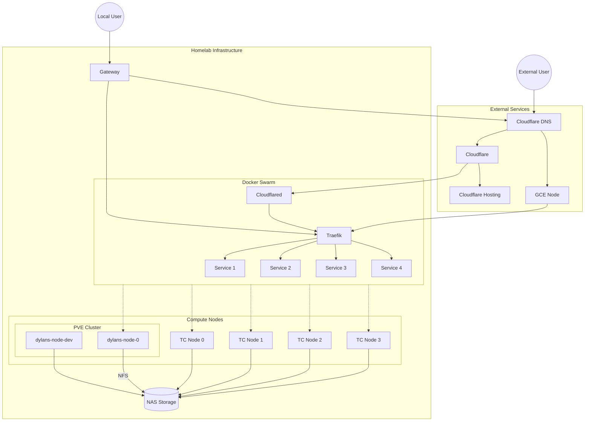

```mermaid
flowchart TD
%% User nodes with descriptive shapes
    user((External User))
    local-user((Local User))

%% External services grouping
    subgraph external-services ["External Services"]
        cloudflare[Cloudflare]
        cloudflare-hosting[Cloudflare Hosting]
        cloudflare-dns[Cloudflare DNS]
        gce[GCE Node]
    end

%% Homelab main grouping
    subgraph homelab ["Homelab Infrastructure"]
    %% Compute nodes section
        subgraph compute-nodes ["Compute Nodes"]
        %% PVE cluster (VM-based compute)
            subgraph pve ["PVE Cluster"]
                dev["dylans-node-dev"]
                node0["dylans-node-0"]
            end

        %% TC nodes (bare metal compute)
            tc0[TC Node 0]
            tc1[TC Node 1]
            tc2[TC Node 2]
            tc3[TC Node 3]
        end

    %% Storage
        nas[("NAS Storage")]

    %% Gateway
        gateway[Gateway]

    %% Docker Swarm
        subgraph swarm ["Docker Swarm"]
        %% Services users interact with
            service-1[Service 1]
            service-2[Service 2]
            service-3[Service 3]
            service-4[Service 4]

        %% Infrastructure services
            cloudflared[Cloudflared]
            traefik[Traefik]
        end
    end

%% External connections
    local-user --> gateway
    gateway --> cloudflare-dns
    gateway --> traefik

    user --> cloudflare-dns
    cloudflare-dns --> cloudflare
    cloudflare --> cloudflared
    cloudflared --> traefik
    cloudflare --> cloudflare-hosting

    cloudflare-dns --> gce
    gce --> traefik

%% Visual representation showing any service can run on any compute node
    swarm -..-> node0 & tc0 & tc1 & tc2 & tc3

%% NFS connections
    dev --> nas
    node0 --NFS--> nas
    tc0 --> nas
    tc1 --> nas
    tc2 --> nas
    tc3 --> nas

%% Traefik routing
    traefik --> service-1
    traefik --> service-2
    traefik --> service-3
    traefik --> service-4
```
