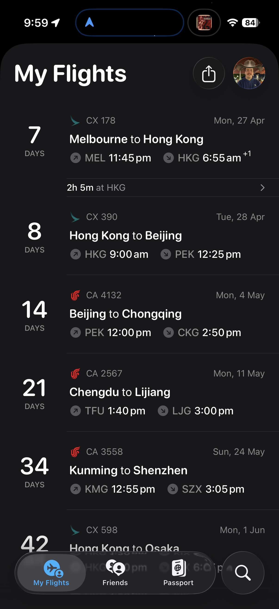

Today I was supposed to be packing. I wasn't. Instead I spent the day building a tool to make blogging from the road actually enjoyable—the kind of thing that lets me dump photos and voice notes throughout the day and have them stitched into a post by evening, instead of sitting down exhausted trying to write three thousand words from scratch.

I've done the daily-blog thing before. It always hits the same wall: the writing takes forever, and skipping days becomes easier each time. This time I wanted something that gets out of my own way. So I built it.

Seven days until Beijing. Packing will have to wait.
